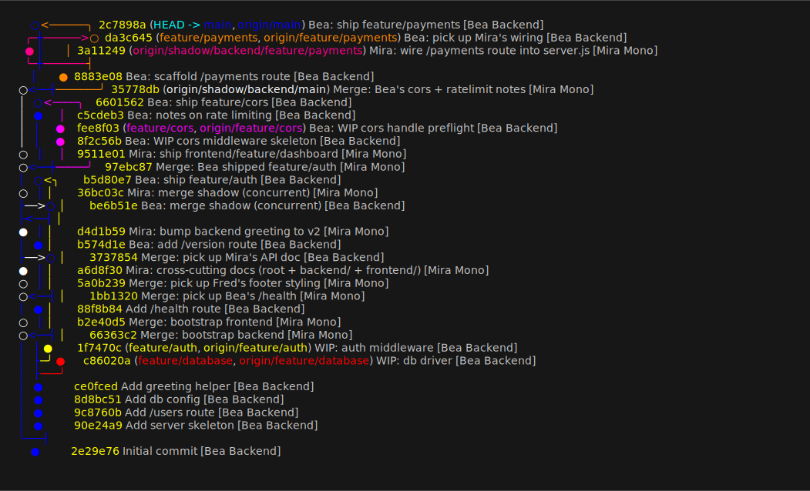
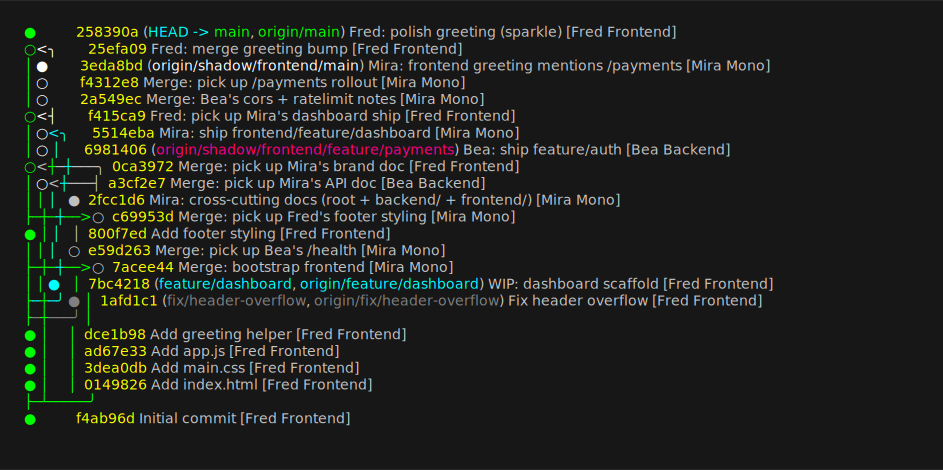
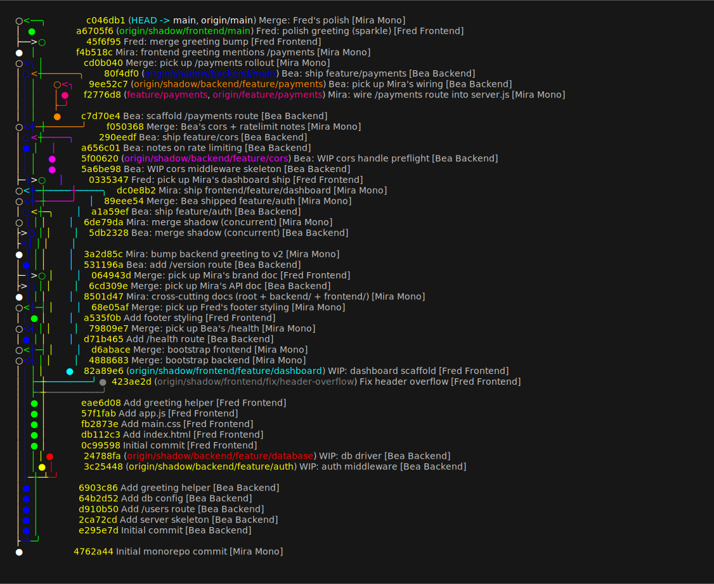

# sht5-main

Monorepo. `backend/` is synced with [sht5-backend](https://github.com/negedng/sht5-backend),
`frontend/` is synced with [sht5-frontend](https://github.com/negedng/sht5-frontend), via the
standalone [sht5-orchestrator](https://github.com/negedng/sht5-orchestrator) running
[shadow-sync](https://github.com/negedng/shadow-sync). This README is monorepo-only — it must
NEVER appear in either external repo.

## Three teams, three identities

Every commit in every repo is authored by exactly one of three people:

| Identity              | Where they commit                       |
| --------------------- | --------------------------------------- |
| **Bea Backend**   🟠  | `sht5-backend` (this monorepo's `backend/`) |
| **Fred Frontend** 🟢  | `sht5-frontend` (this monorepo's `frontend/`) |
| **Mira Mono**     🟣  | `sht5-main` (root files, integration merges, cross-cutting changes) |

Authorship is preserved end-to-end: a commit Bea makes in `sht5-backend` shows up in this
monorepo authored by Bea, with the path remapped from `cors.go` → `backend/cors.go`. Same for
Fred. Mira owns the merge commits that pull each side's `shadow/` branch into `main`, plus any
cross-cutting changes she makes directly in the monorepo.

## Branch graphs

Lane-based layout (each branch gets its own column, time flows downward — same shape as
VSCode's Git Graph). Rendered as native SVG by [`mlange-42/git-graph --svg`](https://github.com/mlange-42/git-graph)
— a purpose-built tool, no hand layout. Earlier versions piped the ANSI output through
[`charmbracelet/freeze`](https://github.com/charmbracelet/freeze) to keep commit messages, but
freeze rendered passing-through lane lines with the wrong color (showing green/blue where shadow
should have been white) once a lane's tip was scrolled off; native SVG draws lines only where
lanes actually exist, so it's free of that artifact.

A custom git-graph model per repo (vendored under [`docs/`](docs/)) assigns a unique color to
each *logical* branch via the `[svg_colors]` section — wherever the same content appears (own
branch, `shadow/<pair>/...` replay), it gets the same color. Three different "main"s show up
since each repo has its own:

| Logical branch (content) | Where it appears | Color |
| --- | --- | --- |
| **backend's main** | `sht5-backend/main`, `sht5-main/shadow/backend/main` | 🔵 blue |
| **frontend's main** | `sht5-frontend/main`, `sht5-main/shadow/frontend/main` | 🟢 green |
| **monorepo's main** | `sht5-main/main`, `sht5-backend/shadow/backend/main`, `sht5-frontend/shadow/frontend/main` | ⚪ white |
| `feature/auth` | `sht5-backend/feature/auth`, `sht5-main/shadow/backend/feature/auth` | 🟡 yellow |
| `feature/database` | `sht5-backend/feature/database`, `sht5-main/shadow/backend/feature/database` | 🔴 red |
| `feature/cors` | `sht5-backend/feature/cors`, `sht5-main/shadow/backend/feature/cors` | 🟣 magenta |
| `feature/payments` (Bea's source) | `sht5-backend/feature/payments`, `sht5-main/shadow/backend/feature/payments` | 🟧 orange |
| `feature/payments` (Mira's branch — different logical branch, same name) | `sht5-main/feature/payments`, `sht5-backend/shadow/backend/feature/payments`, `sht5-frontend/shadow/frontend/feature/payments` | 🟪 pink |
| `feature/dashboard` | `sht5-frontend/feature/dashboard`, `sht5-main/shadow/frontend/feature/dashboard` | 🩵 cyan |
| `fix/header-overflow` | `sht5-frontend/fix/header-overflow`, `sht5-main/shadow/frontend/fix/header-overflow` | ⚫ gray |

`feature/payments` is the collaborative case but it actually splits into *two distinct
logical branches* that share the name:
- 🟧 **orange** — the branch Bea created on backend and pushed (replays as `shadow/backend/feature/payments` in the monorepo).
- 🟪 **pink** — the branch Mira created on the monorepo (`feature/payments`, branched off the orange shadow tip and added her own commit). It's mirrored as `shadow/backend/feature/payments` on backend (Bea merged this back into orange) and as `shadow/frontend/feature/payments` on frontend (path-stripped to empty since Mira's commit only touched `backend/`).

### `sht5-backend`


### `sht5-frontend`


### `sht5-main` (this repo)


## Regenerating the graphs

```
# one-time
gh release download v0.7.0 --repo mlange-42/git-graph --pattern '*windows-amd64*' \
    -D ~/bin/git-graph-tool && tar -xzf ~/bin/git-graph-tool/*.tar.gz -C ~/bin/git-graph-tool/
mkdir -p ~/AppData/Roaming/git-graph/models
for r in backend frontend monorepo; do
  cp docs/git-graph-model-$r.toml ~/AppData/Roaming/git-graph/models/shadow-$r.toml
done

# regenerate (run with the three repos cloned as siblings)
GG=~/bin/git-graph-tool/git-graph.exe
for r in backend frontend monorepo; do
  case $r in monorepo) src=. ;; *) src=../sht5-$r ;; esac
  $GG -p $src --svg --style round --wrap none --format "%h %s [%an]" \
      -m shadow-$r > docs/graph-$r.svg
done
```
